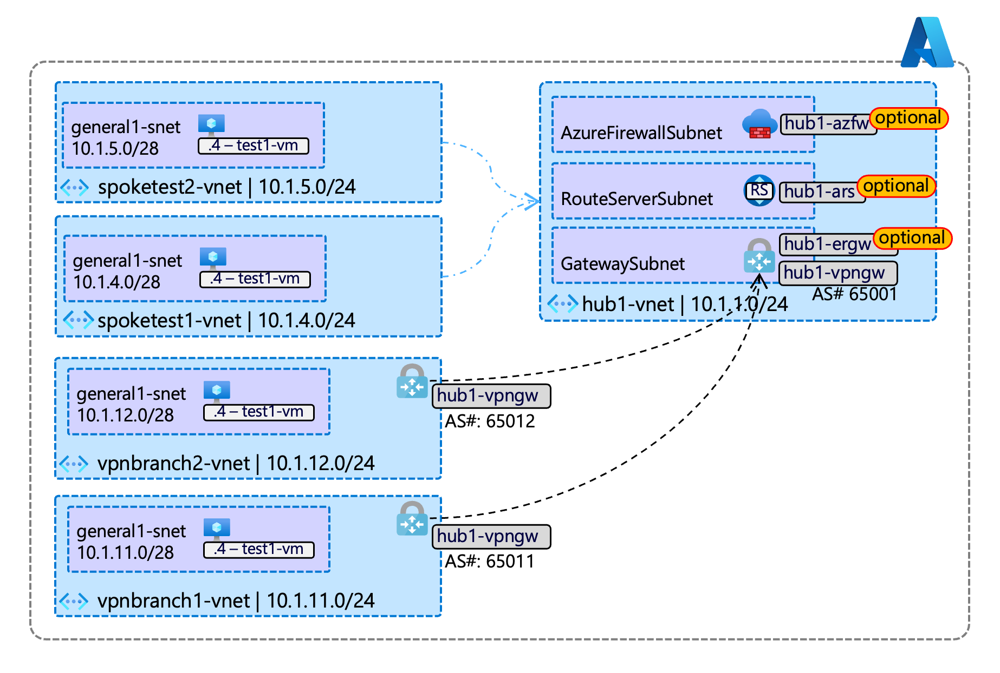

# Common Azure Testbed #01 - Hub and Spoke

- [About this repository](#about-this-repository)
- [IaaS components](#iaas-components)
- [Usage note - Terraform directory structure](#usage-note---terraform-directory-structure)
- [Usage note - Github Actions workflow and branches](#usage-note---github-actions-workflow-and-branches)
- [Prerequisites and setup procedures](#prerequisites-and-setup-procedures)

# About this repository

Two main features:

- Terraform code to deploy a common Azure IaaS test environment, based on reference hub-and-spoke architecture.
- Deployment and destroy workflow with Github Actions

Aside from providing a quickly deployable repository, it also serves as a reference of what a CD workflow on Azure could look like.

Development backstory and the whys are provided in [DEVNOTES.md](./DEVNOTES.md) for those who are interested.

# IaaS components

- Generic hub capable of VPN/ER gateways, Azure Firewall, and Route Servers
- Test VNET-peered spokes with a VM in each to test connectivity
- Test S2S-IPSec spokes to simulate BGP-enabled branches, to study route propagation behaviors (subject to VPN gateway limitations)



# Usage note - Terraform directory structure

Github Actions workflow will only deploy artifacts in [./main] folder.  
It contains declarative part of the code and call modules if needed.  
Included sample resources are broken into an independent files so user can selectively delete or move unnecessary resources to [./main-nodeploy] folders.

# Usage note - Github Actions workflow and branches

<u>Terraform Deploy</u> workflow deploys the code. It is set to trigger at push for [dev*] branches for rapid development. One can also spin up another set of environment quickly by simply creating another [devN] branch and push - as the workflow uses branch name as part of resource group prefix.

In my use case, [main] branch is being used as a known good code storage.

<u>Terraform Destroy</u> workflows are self-explanatory.

<u>azcli-nukeit</u> destroy the environments by means of using Azure CLI to directly delete resource groups and state blob in case Terraform Destroy workflow fails.

# Prerequisites and setup procedures

The workflow requires following Github repository secrets. This can be defined in Github repo > Settings > Secrets and variables > Actions > "New repository secrets"

Gather these values as you proceed through below steps

| Secret name | Value | Notes |
| --- | --- | --- |
| ARM_TENANT_ID | Target Entra ID Tenant ID | for Terraform authentication to Azure |
| ARM_CLIENT_ID | Service Principal (appId) | for Terraform authentication to Azure |
| ARM_CLIENT_SECRET | Service Principal secret (password) | for Terraform authentication to Azure |
| ARM_SUBSCRIPTION_ID | Target subscription ID |
| TFSTATE_CONTAINER_NAME | Set to 'tfstate' | Container name for Terraform state. |
| TFSTATE_RESOURCE_GROUP | Resource Group name containing Storage Account for Terraform state |
| TFSTATE_STORAGE_ACCOUNT | Name of the Storage Account containing Terraform state |

## 1. Prepare Azure Storage Account for Terraform state file

This Terraform workflow opt to use Azure blob backend.

- create an Azure Storage Account
- create a container 'tfstate' within the Storage Account

## 2. Create a service principal

In this step we will create a service principal in your Entra ID tenant for Terraform to authenticate into Azure as.

Below is a sample Azure CLI script to accomplish this setup. Make sure your bash shell is authenticated and Azure CLI is pointing to the target Entra ID tenant.

```bash
APPDISPLAYNAME="githubactions1-sp"
SUBSCRIPTIONID="<masked>"
az ad sp create-for-rbac --display-name=$APPDISPLAYNAME --scopes="/subscriptions/$SUBSCRIPTIONID" --role="Contributor"
```

Take note the values [AppId, password, tenant] from these output.
```json
{
  "appId": "<masked>",
  "displayName": "pngithubactions1-sp",
  "password": "<masked>",
  "tenant": "<masked>"
}
```

## 3. Assign blob data contributoe role to the storage account

Set shell variables with the Resource Group and Storage Account name created in Step 1.
```bash
TFSTATE_RESOURCE_GROUP="resourcegroupname"
TFSTATE_STORAGE_ACCOUNT="storageaccountname"

SPOBJID=$(az ad sp list --display-name=$APPDISPLAYNAME --query="[].id" -o tsv)

az role assignment create \
--role="Storage Blob Data Contributor" \
--assignee-object-id=$SPOBJID \
--assignee-principal-type="ServicePrincipal" \
--scope="/subscriptions/$SUBSCRIPTIONID/resourceGroups/$TFSTATE_RESOURCE_GROUP/providers/Microsoft.Storage/storageAccounts/$TFSTATE_STORAGE_ACCOUNT"
```

At this point you should have all of the required value to setup Github secrets.